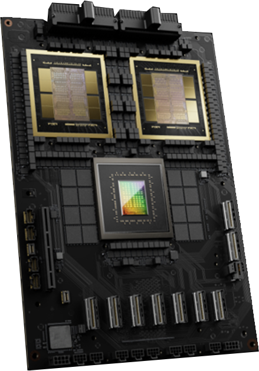

# Chapter 02. AI System Hardware Overview

## 1. The CPU and GPU Superchip

The first implementation of the superchip was Grace Hopper (GH200), which pairs one Grace CPU with one Hopper GPU. Next came the Grace Blackwell (GB200) Superchip, which pairs one Grace CPU with two Blackwell GPUs in the same package. 

In a traditional system, the CPU and GPU have separate memory pools and communicate over a relatively slow bus (like PCIe), which means data has to be copied back and forth. NVIDIA’s superchip eliminates that barrier by connecting the CPU and GPUs with a custom high-speed link called **NVLink-C2C** (chip-to-chip), provides up to ~900 GB/s between the Grace CPU and the Blackwell GPUs in GB200 Superchips. And, importantly, it is cache-coherent. Cache coherency means the CPU and GPU share a coherent, unified memory architecture. As such, they always see the same values.

From a programmer’s perspective, the unified virtual address space and coherence simplify correctness. However, for performance, one should explicitly manage placement and memory movement using techniques such as asynchronous prefetch and staged pipelines. GPU memory is still much faster and closer to the GPU cores than CPU memory—you can think of the CPU memory as a large but somewhat slower extension. Accessing data in LPDDR5X isn’t as quick as HBM on the GPU. It’s on the order of 10× lower bandwidth and higher latency. 

## 2. NVIDIA Grace CPU