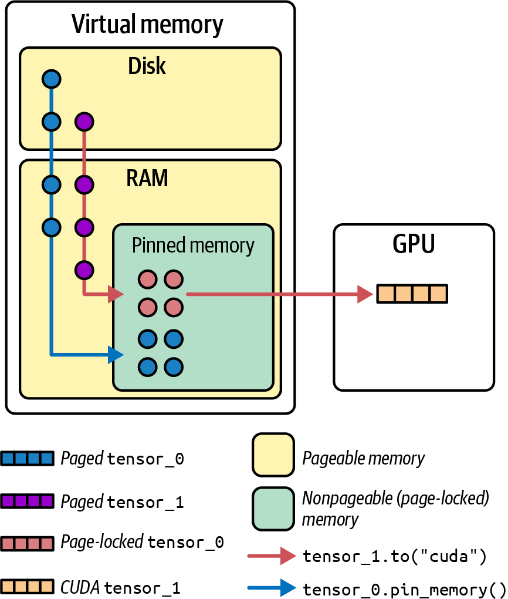

# Chapter 03. OS, Docker, and Kubernetes Tuning for GPU-Based Environments

## I. Configuring the CPUs and OS for GPU Environments

One of the most common reasons that GPUs don’t reach full utilization is that the CPU isn’t keeping them fed with useful work. In a typical training loop, the CPU is responsible for preparing the next batch of data, including loading the data from disk, tokenizing the data, transforming it, etc.

To avoid this, we need to optimize how the CPU and OS handle GPU workloads. These optimizations include setting the CPU affinity to avoid cross-NUMA-node traffic so the right cores handle the right data.

### 1. NUMA Awareness and CPU Pinning

Modern server CPUs have dozens of cores and are often split into multiple NUMA nodes. A NUMA node is a logical grouping of CPUs, GPUs, network interface controllers (NICs), and memory that are physically close to one another.

For example, if a process running on a CPU in NUMA node 0 needs to access a GPU in NUMA node 1, it will need to send data across an internode link, which will incur higher latency.

To explicitly specify NUMA-affinity, you need to “pin” processes or threads to specific CPUs that are connected to the same NUMA node as the GPU. This type of CPU affinity is called **CPU pinning**. 

```sh
#!/bin/bash

# NUMA topology binding script
# Dynamically queries the topology using nvidia-smi topo and binds processes to GPUs using the local NUMA node

for GPU in 0 1 2 3; do
    # Query NUMA node for this GPU
    NODE=$(nvidia-smi topo -m -i $GPU \
          | awk '/NUMA Affinity/ {print $NF}')
    
    # Launch the training process pinned to that NUMA node
    numactl --cpunodebind=$NODE --membind=$NODE \
            bash -c "CUDA_VISIBLE_DEVICES=$GPU python train.py --gpu $GPU" &
done

# Wait for all background processes to complete
wait
```

In practice, pinning can eliminate unpredictable CPU scheduling behavior. It ensures that a critical thread such as a data-loading thread for your GPU doesn’t suddenly get migrated by the OS to a core on a different NUMA node in the middle of training or inferencing. In practice, it’s possible to see 5%–10% training throughput improvements just by eliminating cross-NUMA traffic and CPU core migrations.

### 2. NUMA-Friendly Memory Allocation and Memory Pinning

By default, a process will allocate memory from the NUMA node of the CPU it’s currently running on. So if you pin a process to NUMA node 0, its memory will naturally come from NUMA node 0’s local RAM, which is ideal. However, if the OS scheduler migrates threads, or if some memory was allocated before you did the pinning, you could end up with the nonideal scenario in which a process running in NUMA node 0 is using memory from NUMA node 1. In this case, every memory access has to hop to the other NUMA node, negating the benefit of CPU pinning.

To avoid this, the numactl `--membind` option forces memory allocation from a specific NUMA node, as mentioned in an earlier section. In addition, pinned memory, also called **page-locked memory**, is essential for efficient and direct GPU access. When memory is pinned, the OS won’t swap or move it. This leads to faster direct memory access (DMA) transfers. Copying data from pinned host memory to GPU can be 2–3× faster than from regular pageable memory since the GPU or NIC can perform DMA directly.

<span style="display:block;text-align:center"></span>

### 3. Transparent Hugepages

In addition to pinning memory and binding it to NUMA nodes, we should talk about transparent hugepages (THPs). Linux memory management typically uses 4 KB pages, but managing millions of tiny pages is inefficient when you have processes using tens or hundreds of gigabytes of memory, as in the case of deep learning datasets.

Hugepages—2 MB or even 1 GB pages—can reduce the overhead of virtual memory management by making memory chunks bigger. The main benefits are fewer page faults and less pressure on the translation lookaside Buffer (TLB). The TLB is a cache that the CPU uses to map virtual addresses to physical ones. Fewer, larger pages means the TLB can cover more memory with the same number of entries, reducing misses. Enabling THP is a simple win on most systems since the kernel will automatically back large allocations with 2 MB pages. 

### 4. Scheduler and Interrupt Affinity

TODO

### 5. Virtual Memory and Swapping

It goes without saying, but you should always try to avoid memory swapping. If any part of your process’s memory gets swapped to disk, you will see a catastrophic, multiple-orders-of-magnitude slowdown. GPU programs tend to allocate a lot of host memory for data caching. If the OS decides to swap some data out of memory and onto disk, the GPU will experience huge delays when it needs to access that data.

We recommend setting `vm.swappiness=0`, which tells Linux to avoid swapping except under extreme memory pressure. 

### 6. Filesystem Caching and Write-Back

TODO

### 7. CPU Frequency and C-states

TODO

### 8. Tune Host CPU Memory Allocator

On a well-tuned GPU server, CPU usage may not be very high since GPUs handle most of the computation. However, CPU usage should remain steady and in lockstep with GPU activity. The CPUs must stay busy preparing each incoming batch while the current batch is being processed by the GPU.

You can tune `jemalloc` with the `MALLOC_CONF` environment variable as follows:

```sh
export MALLOC_CONF="narenas:8,dirty_decay_ms:10000,muzzy_decay_ms:10000
,background_thread:true"
```

Similarly, `tcmalloc` benefits from tuning the `TCMALLOC_MAX_TOTAL_THREAD_​CACHE_BYTES` and `TCMALLOC_RELEASE_RATE` environment variables.

```sh
export TCMALLOC_MAX_TOTAL_THREAD_CACHE_BYTES=$((512*1024*1024))
export TCMALLOC_RELEASE_RATE=16
```

In short, optimizing the allocator can reduce allocator overhead and fragmentation. Experiment with these environment variables and tune them for your specific workload and environment.

### Sytem tuning script

Below is tunning script for GPU performance environment:

```sh
#!/bin/bash

# System-wide performance tuning for GPU environments
# Run as root or with sudo

echo "Applying system-wide GPU performance optimizations..."

# 1. CPU Governor and C-states
echo "Setting CPU governor to performance mode..."
cpupower frequency-set -g performance
echo "Disabling deep C-states in BIOS (manual step required)"

# 2. Virtual Memory and Swapping
echo "Disabling swap and setting swappiness to 0..."
swapoff -a
echo 0 > /proc/sys/vm/swappiness

# 3. Transparent Huge Pages - enable for training, disable for inference
echo "Configuring Transparent Huge Pages..."
# For training workloads (throughput-focused):
echo always > /sys/kernel/mm/transparent_hugepage/enabled
# For inference workloads (latency-focused), use:
# echo never > /sys/kernel/mm/transparent_hugepage/enabled

# 4. Filesystem and I/O tuning
echo "Tuning filesystem cache settings..."
echo 20 > /proc/sys/vm/dirty_ratio
echo 10 > /proc/sys/vm/dirty_background_ratio

# 5. Network optimizations
echo "Optimizing network settings for RDMA/InfiniBand..."
echo 'net.core.rmem_max = 268435456' >> /etc/sysctl.conf
echo 'net.core.wmem_max = 268435456' >> /etc/sysctl.conf
echo 'net.ipv4.tcp_rmem = 4096 87380 268435456' >> /etc/sysctl.conf
echo 'net.ipv4.tcp_wmem = 4096 65536 268435456' >> /etc/sysctl.conf
sysctl -p

# 6. Interrupt affinity (example for 8-core system)
echo "Setting interrupt affinity..."
# This would need to be customized per system
# Example: bind GPU interrupts to specific cores
for irq in $(grep nvidia /proc/interrupts | cut -d: -f1); do
    echo 2 > /proc/irq/$irq/smp_affinity  # Bind to CPU 1
done

# 7. ulimits for memory locking
echo "Setting unlimited locked memory..."
cat >> /etc/security/limits.conf << EOF
* soft memlock unlimited
* hard memlock unlimited
* soft nofile 1048576
* hard nofile 1048576
EOF

# 8. GPU-specific optimizations
echo "Configuring GPU settings..."
# Enable persistence mode for all GPUs
nvidia-smi -pm 1

# Enable MPS (optional, for multi-process scenarios)
# export CUDA_MPS_PIPE_DIRECTORY=/tmp/nvidia-mps
# export CUDA_MPS_LOG_DIRECTORY=/tmp/nvidia-log
# nvidia-cuda-mps-control -d

# 9. NUMA balancing
echo "Disabling automatic NUMA balancing..."
echo 0 > /proc/sys/kernel/numa_balancing

# 10. CPU isolation (example - isolate CPUs 2-7 for compute)
# This requires kernel parameter: isolcpus=2-7 nohz_full=2-7
echo "CPU isolation requires kernel boot parameters:"
echo "Add to GRUB: isolcpus=2-7 nohz_full=2-7 rcu_nocbs=2-7"

echo "System tuning complete. Reboot recommended for all changes to take effect."
echo "Remember to update /etc/default/grub with CPU isolation parameters if needed."
```

## II. GPU Driver and Runtime Settings for Performance

TODO

## III. Container Runtime Optimizations for GPUs

TODO

## IV. Kubernetes for Topology-Aware Container Orchestration and Networking

TODO